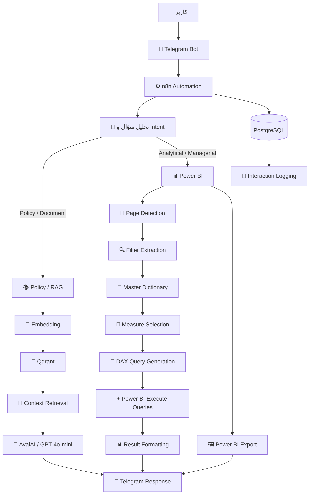

# 🤖 HR AI Analytics Assistant — n8n Automation

> A Persian-language AI-powered HR assistant built with n8n, Telegram, RAG, Qdrant, AvalAI and Power BI Service.

---

# 🇮🇷 فارسی

## 📌 معرفی پروژه

مینی پروژه **HR AI Analytics Assistant** یک Automation مبتنی بر **n8n** است که به کاربر اجازه می‌دهد سؤالات منابع انسانی خود را به زبان طبیعی و از طریق **Telegram** مطرح کند.
در این پروژه Workflow بر اساس نوع سؤال، درخواست را به یکی از دو مسیر اصلی **Policy / RAG** یا **Power BI** هدایت کرده و پاسخ متنی، عددی یا تصویری مناسب را برمی‌گرداند.

هدف پروژه، ایجاد یک رابط طبیعی و هوشمند بین کاربر و منابع اطلاعاتی منابع انسانی است؛ به‌گونه‌ای که کاربر بدون نیاز به جست‌وجوی دستی در اسناد، نوشتن Query یا پیمایش مستقیم داشبورد، بتواند اطلاعات موردنیاز خود را دریافت کند.

این پروژه با استفاده از **داده‌ها و اسناد کاملاً فرضی** ساخته شده و به هیچ سازمان واقعی وابسته نیست.

---

## 🏗️ معماری نهایی پروژه

معماری نهایی Workflow شامل دو مسیر اصلی است:



### 📚 مسیر Policy / RAG

این مسیر برای سؤالات مربوط به سیاست‌ها، آیین‌نامه‌ها، قوانین، فرآیندها و سایر اطلاعات موجود در مستندات HR طراحی شده است.

```text
سؤال کاربر
    ↓
تولید Embedding
    ↓
جست‌وجو در Qdrant
    ↓
بازیابی Context مرتبط
    ↓
ارسال Context به LLM
    ↓
تولید پاسخ
    ↓
ارسال پاسخ به Telegram
```

### 📊 مسیر Power BI

این مسیر برای سؤالات داده‌محور و مدیریتی استفاده می‌شود.

```text
Natural Language Question
        ↓
Intent / Page Detection
        ↓
Filter Extraction
        ↓
Filter Normalization
        ↓
Measure Selection
        ↓
DAX Query Generation
        ↓
Power BI Execute Queries
        ↓
Result Formatting
        ↓
Telegram Response
```

در صورت درخواست کاربر برای دریافت تصویر، صفحه مرتبط Power BI نیز Export شده و در Telegram ارسال می‌شود.


در صورت وجود فیلترهای پشتیبانی‌شده در سوال، فیلترها تا حد امکان **هم روی نتیجه عددی و هم روی تصویر Export‌شده** اعمال می‌شوند.

فیلترهای مورد استفاده شامل مواردی مانند جنسیت، وضعیت تأهل، واحد سازمانی، سطح شغلی، سطح تحصیلات، زمینه تحصیلات، تعلق شغلی، اضافه‌کاری، وضعیت ترک خدمت، عنوان شغلی و سطح ریسک هستند.


### 🔗 Power BI Dashboard Repository

داشبورد Power BI مورد استفاده در این پروژه در یک Repository جداگانه توسعه و مستندسازی شده است.

این Repository شامل طراحی داشبورد، مدل داده، Measures و تحلیل‌های منابع انسانی است و به‌عنوان لایه Analytics & Visualization این پروژه استفاده می‌شود.

👉 **[مشاهده Repository داشبورد Power BI](https://github.com/MonaKheirieh/HR-Analytics-PowerBI)**


## 🧠 LLM & RAG

برای پردازش زبان طبیعی، تحلیل Intent و تولید پاسخ از **AvalAI با مدل GPT-4o-mini** استفاده شده است.

در مسیر RAG، **Qdrant** به‌عنوان Vector Database استفاده شده و مدل چندزبانه `paraphrase-multilingual-MiniLM-L12-v2` از طریق **Hugging Face Inference API** برای تولید Embedding مورد استفاده قرار گرفته است.

---

## 🔎 مدیریت و نرمال‌سازی فیلترها

یکی از بخش‌های کلیدی پروژه، تبدیل عبارت‌های مختلف زبان طبیعی فارسی به مقادیر استاندارد قابل استفاده در Power BI است.

برای این منظور یک **Master Dictionary / Normalization Layer** طراحی شده است.

این لایه ورودی‌های مختلف کاربر را به مقادیر استاندارد تبدیل می‌کند؛ برای مثال:

```text
زن / خانم / مونث
        ↓
زن
```

همین منطق برای وضعیت تأهل، واحد سازمانی، سطح شغلی، سطح تحصیلات، زمینه تحصیلات، تعلق شغلی، اضافه‌کاری و سایر ابعاد HR نیز پیاده‌سازی شده است.

نام ستون‌های واقعی مدل Power BI نیز در زمان ساخت Query رعایت می‌شوند.

---

## 🖼️ Power BI Screenshot Integration

در سؤالات مدیریتی که کاربر درخواست تصویر داشته باشد، Workflow صفحه مرتبط Power BI را Export کرده و تصویر را در Telegram ارسال می‌کند.

```text
Question
   ↓
Page Detection
   ↓
Filter Detection
   ↓
Power BI Page Export
   ↓
Apply Supported Filters
   ↓
Send Image to Telegram
```

در صورت وجود فیلترهای پشتیبانی‌شده، همان فیلترها روی تصویر نیز اعمال می‌شوند.

در صورت نبود فیلتر خاص، تصویر کامل صفحه مرتبط ارسال می‌شود.

---

## 🗄️ PostgreSQL

در معماری نهایی، PostgreSQL به‌عنوان مسیر مستقل تحلیل داده استفاده نمی‌شود.

کاربرد PostgreSQL در این Automation، **ثبت و نگهداری اطلاعات تعاملات و Logging Workflow** است.

مسیر تحلیلی اصلی پروژه برای سؤالات داده‌محور از **Power BI Service** استفاده می‌کند.

---

## 📊 Validation & Testing

نسخه نهایی Workflow با **100 سؤال متنوع** در سناریوهای مختلف تست شد.

### نتیجه تست

**98 پاسخ صحیح از 100 تست — 98% Accuracy**

سناریوهای تست شامل موارد زیر بودند:

- سؤالات Policy و RAG
- سؤالات عددی Power BI
- فیلترهای چندگانه
- سؤالات Ranking
- مقایسه گروه‌های مختلف کارکنان
- سؤالات مدیریتی
- Page Selection
- Measure Selection
- Filter Normalization
- DAX Query Generation
- Power BI Screenshot Requests
- سؤالات مرتبط با Attrition
- سؤالات مرتبط با HR Risk

فایل Excel مربوط به Test Matrix و نتایج تست‌ها در Repository قرار گرفته است.

---

## 🛠️ Tech Stack

- **n8n** — Workflow Orchestration
- **Telegram Bot** — User Interface
- **AvalAI / GPT-4o-mini** — LLM
- **Qdrant** — Vector Database
- **Hugging Face Inference API** — Embedding
- **Power BI Service** — Analytics & Visualization
- **DAX** — Analytical Query Generation
- **PostgreSQL** — Interaction Logging
- **Docker** — Infrastructure

---

## 📁 Repository Contents

برای حفظ امنیت، فایل کامل JSON مربوط به Workflow در Repository عمومی قرار نگرفته است.

ساختار Repository:

```text
HR-AI-Analytics-Assistant/
│
├── README.md
│
├── screenshots/
│   ├── telegram-bot-response.png
│   ├── n8n-architecture.png
│   ├── policy-rag-path.png
│   ├── powerbi-path-part-1.png
│   └── powerbi-path-part-2.png
│
├── video/
│   └── n8n-workflow-demo.mp4
│
├── tests/
│   └── HR_bot_test.xlsx
│
├── rag/
│   └── hr_policies.txt
│
└── docs/
    └── project-documentation.pdf
```

---

## 🔐 Security

برای این Repository عمومی، موارد زیر منتشر نشده‌اند:

- API Keys
- Bearer Tokens
- Passwords
- Telegram Credentials
- Connection Strings
- Credentialهای محیط اجرا

همچنین فایل کامل Production Workflow مربوط به n8n عمداً در Repository عمومی قرار نگرفته است.


---

# 🇬🇧 English

## 📌 Project Overview

**HR AI Analytics Assistant** is an n8n-based automation that allows users to ask HR-related questions in natural language through **Telegram**.

Based on the question type, the workflow routes the request to either the **Policy / RAG path** or the **Power BI path**, returning a relevant textual, numerical, or visual response.

The main goal is to provide a natural-language interface between HR users and organizational information sources, reducing the need for manual document search, query writing, or direct dashboard navigation.

This project is built entirely on **fictional HR data and documents** and is not affiliated with any real organization.

---

## 🏗️ Final Architecture

The final workflow contains two main paths:

```text
User
 │
 ▼
Telegram Bot
 │
 ▼
n8n Automation
 │
 ▼
Intent & Question Analysis
 │
 ├──────────────► Policy / RAG
 │                    │
 │                    ├── Embedding
 │                    ├── Qdrant
 │                    ├── Context Retrieval
 │                    └── AvalAI / GPT-4o-mini
 │
 └──────────────► Power BI
                      │
                      ├── Page Detection
                      ├── Filter Extraction
                      ├── Filter Normalization
                      ├── Measure Selection
                      ├── DAX Query Generation
                      ├── Execute Queries
                      └── Power BI Export
 │
 ▼
Telegram Response

PostgreSQL
     │
     └── Interaction Logging
```

---

## 📚 Policy / RAG Path

This path handles questions related to:

- HR policies
- HR procedures
- regulations
- organizational HR documents

General flow:

```text
User Question
    ↓
Embedding Generation
    ↓
Qdrant Search
    ↓
Relevant Context Retrieval
    ↓
LLM
    ↓
Grounded Response
    ↓
Telegram
```

The retrieved context is provided to the LLM so that responses are grounded in the relevant HR documentation.

---

## 📊 Power BI Path

The Power BI path handles analytical and managerial questions.

```text
Natural Language Question
        ↓
Intent / Page Detection
        ↓
Filter Extraction
        ↓
Filter Normalization
        ↓
Measure Selection
        ↓
DAX Query Generation
        ↓
Power BI Execute Queries
        ↓
Result Formatting
        ↓
Telegram Response
```

When requested, the workflow also exports the relevant Power BI page and sends the screenshot through Telegram.

Supported HR dimensions include:

- Gender
- Marital Status
- Department
- Job Level
- Education Level
- Education Field
- Job Involvement
- Overtime
- Attrition Status
- Job Title
- Risk Level

### 🔗 Power BI Dashboard Repository

The Power BI dashboard used in this project is developed and documented in a separate repository.

It contains the HR analytics dashboard, data model, measures, and analytical visualizations that serve as the **Analytics & Visualization layer** of this project.

👉 **[View the Power BI Dashboard Repository](https://github.com/MonaKheirieh/HR-Analytics-PowerBI.git)**

---

## 🧠 LLM & RAG

The workflow uses **AvalAI with GPT-4o-mini** for natural-language processing, intent analysis, and response generation.

For the RAG pipeline:

- **Qdrant** is used as the vector database.
- **paraphrase-multilingual-MiniLM-L12-v2** is used for multilingual embeddings.
- **Hugging Face Inference API** is used to access the embedding model.

---

## 🔎 Filter Normalization

A custom **Master Dictionary / Normalization Layer** maps different Persian user expressions to standardized Power BI filter values.

For example:

```text
زن / خانم / مونث
        ↓
زن
```

The same normalization approach is used for marital status, department, job level, education level, education field, job involvement, overtime, and other HR dimensions.

The actual Power BI model column names are also taken into account during query generation.

---

## 🖼️ Power BI Screenshot Integration

For managerial questions requiring a visual response, the workflow exports the relevant Power BI page and sends the resulting image to Telegram.

```text
Question
   ↓
Page Detection
   ↓
Filter Detection
   ↓
Power BI Export
   ↓
Apply Supported Filters
   ↓
Telegram Image
```

When supported filters are present, they are applied to the exported image as well.

Without specific filters, the full relevant Power BI page is returned.

---

## 🗄️ PostgreSQL

In the final architecture, PostgreSQL is **not used as an independent analytics path**.

It is used for interaction logging and workflow-related records.

The main analytical path relies on **Power BI Service**.

---

## 📊 Validation & Testing

The final workflow was tested with **100 different questions** across multiple scenarios.

### Final Result

**98 correct responses out of 100 — 98% accuracy**

Test scenarios included:

- Policy / RAG questions
- Power BI analytical questions
- Multiple filters
- Ranking questions
- Group comparisons
- Managerial questions
- Page selection
- Measure selection
- Filter normalization
- DAX query generation
- Power BI screenshot requests
- Attrition questions
- HR risk questions

The complete test matrix and results are included in the repository.

---

## 🛠️ Tech Stack

- **n8n** — Workflow Orchestration
- **Telegram Bot** — User Interface
- **AvalAI / GPT-4o-mini** — LLM
- **Qdrant** — Vector Database
- **Hugging Face Inference API** — Embedding
- **Power BI Service** — Analytics & Visualization
- **DAX** — Analytical Query Generation
- **PostgreSQL** — Interaction Logging
- **Docker** — Infrastructure

---

## 📁 Repository Contents

For security reasons, the complete production n8n workflow JSON is intentionally **not included** in the public repository.

The repository contains selected screenshots, the test matrix, a fictional RAG document, and project documentation.

```text
HR-AI-Analytics-Assistant/
│
├── README.md
│
├── screenshots/
│   ├── telegram-bot-response.png
│   ├── n8n-architecture.png
│   ├── policy-rag-path.png
│   ├── powerbi-path-part-1.png
│   └── powerbi-path-part-2.png
│
├── video/
│   └── n8n-workflow-demo.mp4
│
├── tests/
│   └── HR_bot_test.xlsx
│
├── rag/
│   └── hr_policies.txt
│
└── docs/
    └── project-documentation.pdf
```


---

## 🔐 Security

The public repository does not contain:

- API Keys
- Bearer Tokens
- Passwords
- Telegram Credentials
- Connection Strings
- Production environment credentials

The complete production n8n workflow is intentionally excluded from the public repository.


---

## ⭐ Project Highlights

- Persian natural-language HR assistant
- Two-path intelligent routing architecture
- RAG-based HR policy question answering
- Qdrant vector search
- Multilingual embedding generation
- Power BI analytical query generation
- DAX-based analytics
- Automatic filter normalization
- Power BI page detection
- Power BI screenshot export
- Telegram-based interaction
- Interaction logging with PostgreSQL
- 100-question validation set
- 98% final test accuracy
- Security-conscious public repository structure
